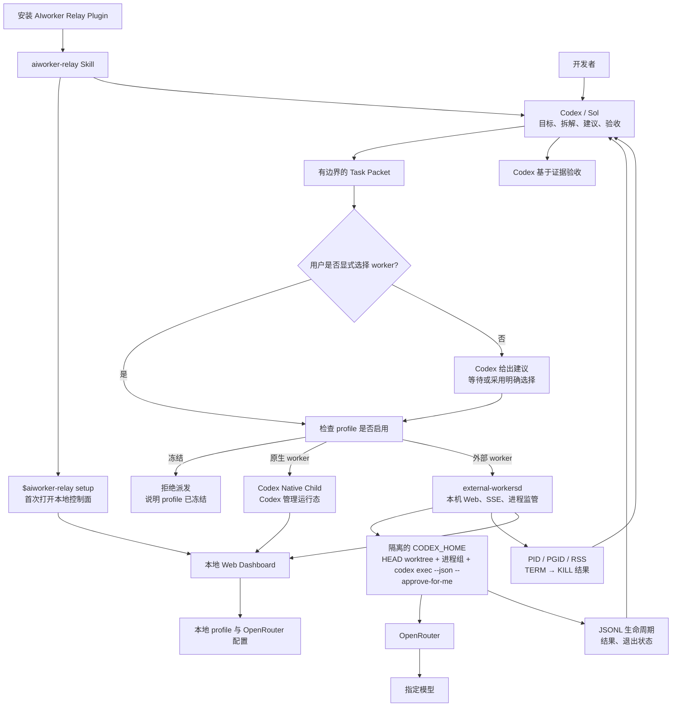
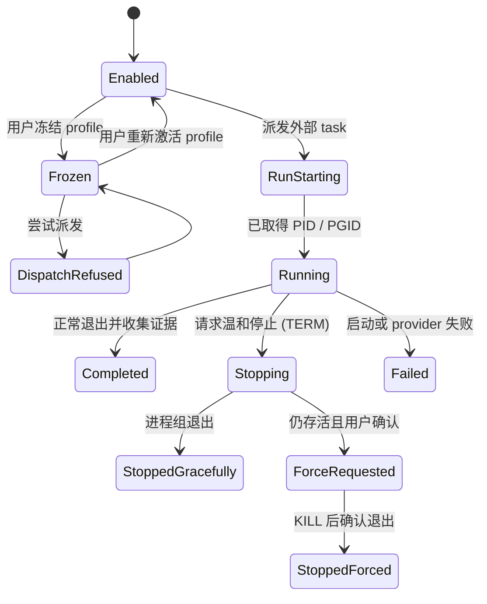

# 目标架构

状态：v0.1.9 已实现本地控制面、静态看板、Profile、隔离 run 和证据路径；Git-backed Marketplace 的干净安装与两次更新、以及 bundle/runtime/daemon 的 setup 收敛均已实测。非交互式 `codex exec` 已使用受限的 workspace-write 自动审批；同一 NVIDIA 模型的真实 CLI 工具写入已成功。首个修复后的 dashboard-managed write 则被该免费模型的 OpenRouter `429` 中断，所以“同一个 managed run 同时完成写入和看板闭环”仍不能写成已完成。

## 核心原则

> Codex owns judgment. Workers provide labor and evidence.

外部 worker 是 Codex 的受控派生执行者，不是第二个 orchestrator。系统优先使用文件、子进程、Git 和显式结果，而不是重新发明 agent protocol、状态同步或 agent loop。

## Codex 集成与安装边界

正式分发单元是 **AIworker Relay** Codex Plugin，核心入口是 `aiworker-relay` Skill。Plugin 解决“如何把这项能力交给 Codex”；Skill 解决“Codex 何时可使用这项能力”；本地控制面解决“如何配置与监管外部资源”。它们不是三套平行产品。

仓库根目录的 `.agents/plugins/marketplace.json` 是公开 Git marketplace catalog，并以 `git-subdir` 指向同一仓库内的 `./plugins/aiworker-relay`。该目录是唯一可安装的 Plugin source，内含 `.codex-plugin/plugin.json`、Skill、launcher、`pyproject.toml` 与 Python runtime；仓库根目录保留产品文档、图与开发测试材料。它不是第二份 runtime，也不依赖仓库外的全局 Python 包。local marketplace 只保留给源码开发，不作为面向普通开发者的发布说明。

首次配置从一个新的 Codex task 中调用 `$aiworker-relay setup` 开始，随后由 Skill 打开本机 Web 控制面。API Key 与 worker Profile 只在这个 Web 控制面中配置；Skill、Codex 对话与普通 CLI 不接收这些配置值。之后用户仍像平时一样把任务交给 Codex：可以明确指定 profile，也可以接受 Codex 的建议。外部付费用量的派发不应通过不可见的全局拦截发生。

按需启动不等于要求开发者手动启动独立应用。`setup` 会启动或复用 `external-workersd` 并打开浏览器；任何由 Skill 发起的受控外部派发也会自动启动或复用它。它只在有浏览器客户端或活跃外部 run 时保留，二者都没有后自动退出。

安装边界必须保持窄：Plugin 不改写主 Codex 的默认模型、provider、原生 worker profile、系统提示、hooks 或项目 `AGENTS.md`。只有外部 run 使用隔离的 Codex 配置。未来若接入 hooks，它们至多提供可观测性或上下文提示；不作为首版路由的事实来源或强制拦截机制。

## 产品全景



源文件：[aiworker-product-architecture.mmd](../diagrams/aiworker-product-architecture.mmd)。图中本地控制面、supervisor 和项目 `.orch/` 已有 v0.1 实现；费用归因和 native runtime telemetry 仍是目标边界，不是已交付事实。

下表先列出 Plugin 的交付与 Codex 集成边界，再列出四个实际运行层：

| 层 | 组成 | 负责什么 | 不负责什么 |
| --- | --- | --- | --- |
| Plugin 与 Skill | AIworker Relay Plugin、`aiworker-relay` Skill、随包的本地资源 | 向 Codex 分发能力、提供 setup 与受控派发入口 | 不全局接管 Codex，也不替代运行控制面 |
| 开发者与项目 | 开发者、Codex 对话、项目工作区 | 提出目标、明确指定模型或推理档位、查看和停止外部 run | 不直接管理模型 provider 或子进程细节 |
| Codex 控制层 | Codex / Sol、Task Packet、最终验收 | 判断任务是否适合派生、约束 scope、建议 worker、验收证据 | 不把外部模型升格为第二个决策者 |
| 本地运行控制面 | 单个按需 `external-workersd`、本地 Web、profile 配置、external supervisor、`.orch/` | 保存本机配置、发现模型、冻结 profile、监管外部进程和展示真实状态 | 不伪造原生子代理的 PID、RSS 或费用 |
| 外部执行面 | 隔离的 Codex CLI、OpenRouter、选定模型 | 在限定 packet 内完成劳动并返回结果和证据 | 不持有主 Codex 的完整上下文、hook 或最终验收权 |

这不是一个远程 SaaS 架构。除 OpenRouter 与所选模型外，控制面和运行状态都在开发者本机；项目工作区继续是代码事实来源，Git 继续是变更同步方式。

## 已接受的本机技术选型

首版支持 macOS、Windows 和具备系统密钥服务的桌面 Linux。性能目标不是处理海量并发请求，而是让闲置机器没有无意义轮询，让活跃 run 的观测、停止和页面更新保持事件驱动。

| 关注点 | 选择 | 边界与原因 |
| --- | --- | --- |
| 本机进程 | 一个按需 `external-workersd` | 同一 Python 进程服务本机 Web、状态 API、SSE 与外部 run 监管；有 Web 客户端或活跃 run 时存在，两者都没有 60 秒后退出。 |
| 本机运行时 | 用户应用数据目录内的专用 `venv` | 明确的 `$aiworker-relay setup` 检查 Python 3.12+，并在缺失时于同一次操作安装依赖；不假设或改写全局 Python 包。 |
| 本机网络边界 | loopback `127.0.0.1` | Web、SSE 和控制 API 仅服务本机；launcher 通过原子 `daemon.json` 检查、复用或清理失效 daemon 记录。记录绑定一个项目根目录，不同项目会拒绝复用，避免误派 worktree。 |
| 后端 | Python 3.12+、`asyncio`、`aiohttp` | `asyncio` 负责外部 CLI 的异步生命周期；`aiohttp` 只负责本机 HTTP、静态资源和 SSE，避免手写 HTTP 协议或引入 FastAPI/Uvicorn 组合。 |
| 页面 | 静态 HTML、CSS、原生 JavaScript | 不引入 React、构建链、Node 常驻进程或桌面壳。现有原型可直接演进为页面资源。 |
| 实时更新 | SSE 推送状态，HTTP `POST` 执行操作 | 看板主要接收状态；用户只是偶尔保存设置、冻结 profile 或停止 run，因此不需要 WebSocket 或短周期全量轮询。 |
| 进程观测与停止 | `asyncio` + `psutil` | 只对外部 run 读取 `rss`，默认每 2 秒一次；只在停止时枚举进程树。POSIX 使用独立进程组，Windows 使用新进程组与递归进程树终止。 |
| 密钥 | `keyring` | 写入系统 Keychain、Windows Credential Locker 或 Linux Secret Service；密钥服务不可用时设置失败并说明原因，不回退到明文文件。 |
| Provider HTTPS | `truststore` | 对 OpenRouter 请求使用操作系统证书库，不关闭 TLS 校验，也不假设 Python 自带 CA bundle 已正确安装。 |
| 本地数据 | 原子 JSON + JSONL | 用户级 Profile 放在应用数据目录；项目级 run 证据放在 `.orch/runs/`。实际费用汇总在可靠归因前不生成。 |

运行时依赖只有 `aiohttp`、`psutil`、`keyring` 和 `truststore`。不引入数据库、Redis、消息队列、WebSocket 框架、前端框架或额外的进程管理器。

空闲成本边界如下：没有浏览器客户端且没有活跃外部 run 时，守护进程在 60 秒后退出；看板打开但没有外部 run 时，不做状态采样或自动 provider 请求。账户与公开跑分只在用户主动刷新时读取；只有活跃的外部 run 才有一个 2 秒 RSS 采样任务。原生 Codex worker 不进入该采样循环。

## 组件责任与事实来源

| 对象 | 事实来源 | 主要消费者 | 关键边界 |
| --- | --- | --- | --- |
| 目标、scope、验收结论 | Codex / Sol | 开发者、worker | 只有 Codex 可以接受或拒绝结果 |
| Task Packet | Codex 生成的显式任务材料 | 原生或外部 worker | 只带完成任务所需的最小上下文 |
| 外部 profile 的启用或冻结 | 本地控制面 | 派发前检查、看板 | 冻结拒绝新 run，不停止既有 run |
| 模型名称、上下文、价格、隐私标签、推理档位 | 添加 Profile 时的 OpenRouter 模型目录快照 | 添加 Worker 与详情页 | 目录发现不等于本机 harness 已验证；保存快照时间，自动刷新 metadata 仍未实现 |
| 账户总余额或当前 Key 限额 | 用户主动请求的 OpenRouter 账户 / API Key 读取 | 用量页 | 账户总余额需要 management Key；Key 限额不是账户总额，也不是 run 实际费用 |
| 公开跑分 | 用户主动请求的 OpenRouter Benchmarks | Worker 详情页 | 仅保留精确 `model_permaslug` 匹配的来源与时间；不作为本机兼容性或调度资格 |
| 外部 run 是否存活、PID / PGID、RSS、停止结果 | `external-workersd` 的实际 OS 观测 | 看板、Codex 验收 | 不能以按钮点击替代真实退出状态 |
| diff、测试、退出状态、结构化结果 | worker 输出与项目工作区 | Codex | 原始聊天记录不是系统状态 |
| 原生 worker 的运行态 | Codex | 看板 | 只展示 Codex 可确认的配置与权属 |
| 单次实际费用 | 可可靠对应 run 的 provider 原始事实 | 用量视图、预算 | 无法归因时必须显示待归因或不可得 |

## 部署形态

```text
开发者电脑
├── Codex / Sol
├── external-workersd（本地 Web、SSE、external supervisor）
├── 隔离的 Codex CLI 进程组
├── 项目工作区与 Git
└── .orch/（项目级 run 证据与 worktree）
             │
             ▼
      OpenRouter API
             │
             ▼
         指定外部模型
```

没有产品数据库、队列、远程账号体系或自建模型网关。若未来需要多机协作或集中审计，必须作为新的产品需求重新决策，不能从当前本地架构中隐式长出来。

## 控制流



## 两条执行支路

| 支路 | 运行权属 | 看板可展示的事实 | 看板不能承诺的事实 |
| --- | --- | --- | --- |
| 原生 worker | Codex | 已配置的 profile、模型/推理档位、由 Codex 管理、路由验证结果 | 本地 PID、RSS、强制 kill、逐请求费用 |
| 外部 worker | `external-workersd` | profile 状态、PID / PGID、RSS、JSONL 生命周期、停止结果、归因状态 | 未实际获得的 provider 费用或无法确认的子进程状态 |

这不是降级原生 worker；它是诚实地遵循两种控制边界。原生 worker 的生命周期属于 Codex，外部进程才属于 `external-workersd`。

## 外部 worker 的最小运行单元

```text
external profile
    ├── model slug（OpenRouter）
    ├── enabled | frozen             ← 长期可用性状态
    ├── default reasoning policy     ← 固定支持档位 | 用户选择自动
    ├── privacy / retention label
    └── local policy metadata

external run
    ├── task packet reference
    ├── isolated CODEX_HOME
    ├── detached Git worktree from HEAD
    ├── process group
    ├── JSONL lifecycle evidence
    ├── PID / RSS samples
    ├── result / diff / tests
    └── cost attribution state         ← confirmed | pending | unavailable
```

profile 与 run 必须分开。冻结 profile 只阻止新的 run；停止正在运行的 task 使用独立的终止流程。

首发 write run 只有一条隔离路径：从当前项目 `HEAD` 创建 detached Git worktree，写入 `.orch/worktrees/<run-id>`，再以该 worktree 为 `codex exec --cd` 工作目录，并使用 `--approve-for-me` 让非交互式 CLI 在 Codex 的 workspace-write 审批模式下执行工具。它不使用 `--dangerously-bypass-approvals-and-sandbox`。run 不创建 commit、不自动 merge；主工作区的未提交改动不被复制，必须在派发前明确提示给开发者。这个限制避免在首版实现 patch 同步和冲突处理层。

固定的默认推理档位是 profile 配置的一部分，而不是 Codex 可以静默降级的建议。用户在 task 中明确指定档位时优先；只有 profile 被设为“自动”时，Codex 才能为该 run 选择模型实际支持的档位。不同模型的档位枚举不同，界面不能预设一个通用的 `max` 选项。

## 状态与停止语义



本机已验证：一个独立进程组收到 TERM 可以正常退出；忽略 TERM 的受控进程仍存活，随后收到 KILL 后以退出码 137 终止。产品实现必须把这个结果写入 run 记录，而不是只记录按钮点击。

## 配置与秘密边界

- 本地 Web 页面是生产配置 OpenRouter API key 与 profile 的入口；由按需 `external-workersd` 服务。
- 运行时为外部 run 生成隔离的 Codex 配置；不得复用主 Codex 的完整运行目录。
- API key 由 `keyring` 写入系统密钥服务，不进仓库、不进 task packet、不在页面回显；没有可用密钥服务时不允许明文降级。
- `.orch/` 保存项目级 run 元数据、证据与 detached worktree，并被 Git 忽略。
- `.env` 只作为本次受控验证的本机输入，已被 Git 忽略。

## 费用与数据来源

OpenRouter 的原始 API 响应可以给出 token 与实际 `cost`。当前验证中，`codex exec --json` 给出了 lifecycle 和 token 使用量，但没有把 OpenRouter 的 generation ID 或实际 cost 透传给本地 JSONL。因此如何将 provider 的实际费用可靠地归因到一个外部 run，是独立的费用里程碑，而非外部 run 控制路径的实现前提。

账户总余额、当前 Key 限额和公开 benchmark 都是独立的 provider 事实：它们只由用户在 Web 中主动读取。前两者不能代替 run-to-cost 关联；跑分也不能证明某个模型已经在本机 Codex harness 中兼容。管理 Key 可读取账户总余额；普通 Key 的可用信息限于 provider 返回的该 Key 限额。公开 benchmark 只展示精确模型标识的记录及其来源、数据时间。

在此问题解决前：

- 可以显示费用归因状态；只有在不保存原始 transcript 的前提下建立了有界 token 解析后，才显示 token。
- 不可以把模型标价或 `$0` 伪装为实际扣费。
- 日 / 月汇总与预算告警在有可信归因前不启用；后续启用时必须区分已确认费用和未归因使用量。

## 目前刻意未设计的内容

没有 provider adapter 层、数据库、Redis、队列、通用 worktree manager、通用 workflow engine、自动 fallback 链、自动 benchmark 或 LLM judge。首发只实现一条固定的 Git worktree 路径。

这些不属于 v0.1 成立所需的能力。实际费用归因在控制路径可用后单独推进；多项目并发控制面也需要新的产品决定，不能从当前单项目绑定中隐式扩展。
