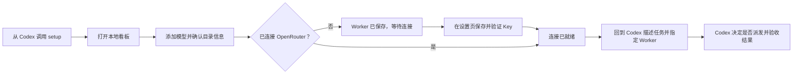

# 首次使用体验优化

状态：首个体验优化切片已实施，并于 2026-08-26 用隔离的无 Key 新用户路径验收。本文记录该切片的目标、结果与后续问题；它不改变既有的派发、隔离或费用归因合同。

`AIworker Relay` 的第一位用户不该先理解 daemon、Profile 或 OpenRouter 的权限类型。他只需要完成一件事：准备一个可由 Codex 明确使用的外部 Worker，然后回到 Codex 正常工作。

这份文档补充 [产品定义](product.md) 和 [新用户使用流程](user-flow.md)。前两者说明产品是什么与完整使用路径，本文只处理首次配置中已经观察到的理解成本。

## 走查结论

本机隔离走查从没有 Key、没有 Worker、没有运行记录的状态开始。测试使用临时数据目录，Key 只在测试进程内使用，没有发起模型任务，也没有改动用户现有的控制面或运行记录。

最重要的结论是：当前的卡顿感主要不是由页面响应时间造成，而是成功之后没有明确的下一步。用户能添加模型，也能保存 Key，但页面没有连续地说明“现在距离可用还差什么”“接下来回到哪里”。

一次本机观察中，模型目录查询约 672ms，保存 Profile 约 314ms，保存并验证 Key 约 532ms。公开 benchmark 查询约 3.1 至 3.4 秒，这是一次按需的远端读取，页面已立即显示加载状态。前三项都不是首次使用体验的主要阻塞点。

## 本次优化前的问题

| 用户时刻 | 当前呈现 | 用户实际会遇到的问题 | 应有的产品呈现 |
| --- | --- | --- | --- |
| 首次打开概览 | 文案说先保存 Key，再添加模型；主按钮却是“添加 Worker” | 入口顺序互相矛盾，用户无法判断该先点哪里 | 允许从“添加 Worker”开始，同时说明 Key 可以随后连接 |
| 没有 Key 时保存模型 | Profile 被创建为 `enabled + unverified`，随后进入详情页 | 用户看到“已启用”，但真实派发仍会因缺少 Key 被拒绝 | 显示“Worker 已保存，等待连接”，主按钮是“配置 Key” |
| 保存 Key 成功 | 只显示“Key 已保存”提示 | 成功消息没有告诉用户接下来可做什么 | 提供一个明确动作：查看已保存 Worker，或返回 Codex 使用它 |
| Key 与 Profile 都已存在 | 概览仍固定显示“配置你的第一个 Worker” | 看板与用户刚完成的操作相互矛盾 | 概览按当前准备程度变化，不再显示过时的首次配置卡 |
| 查看未验证 Worker 详情 | 可见“已启用”“未验证”，但没有解释其实际含义 | 用户不知道能否选择它，也不知道验证发生在何时 | 单独解释启用、连接和本机验证，并给出当前唯一合理的下一步 |
| 打开空运行记录 | 空状态只说任务会被 Codex 派发 | 用户完成配置后仍不知道如何把控制权交回 Codex | 说明“回到 Codex，描述任务并明确指定这个 Worker” |
| 在窄屏打开看板 | 顶栏只保留概览、Workers、运行记录 | 设置与用量入口不可达，首次配置会中断 | 窄屏下仍可进入设置，或从当前页面提供等价的直接入口 |

这里不建议把“添加 Worker”改成必须先填 Key。模型发现本来就应该独立于凭据配置：用户粘贴模型名，系统确认该模型真实存在，再形成一个本地档案。这既符合已接受的产品边界，也让用户能先整理可选模型。

## 本次交付

- 概览按 Worker、连接与验证事实给出下一步；已有档案时不再显示过时的首次配置卡。
- 模型发现、保存 Worker 与 Key 配置保持独立：没有 Key 时，详情页明确显示“等待连接”并引导到设置。
- Key 保存成功后提供回到已保存 Worker 的直接入口；未验证档案会说明需要由用户在 Codex 中明确选择一次实验性任务。
- 空运行记录直接交接回 Codex，并移除了没有记录时无意义的筛选器。
- Worker 状态区区分准备程度、冻结状态与本机验证；冻结档案不会出现重复状态，也不会被表述为可以接收任务。
- 窄屏仍保留“设置”和“用量”入口；推理偏好明确标出 `auto` 由 Codex 为本次任务选择，固定档位由 Profile 固定。
- 用量页说明账户总额与当前 Key 限额的权限差异，不把目录价格或限额伪装成某次任务的实际费用。

## 产品上的三个独立事实

一个外部 Worker 目前有三类不应混淆的事实：

| 事实 | 回答的问题 | 现有来源 |
| --- | --- | --- |
| 可用性 | 用户是否允许它接收新的任务？ | Profile 的 `enabled` 或 `frozen` |
| 连接状态 | 本机是否已有通过验证的 OpenRouter Key？ | 本地钥匙串中的 Key 配置状态 |
| 本机验证 | 该模型是否已经通过指定范围的 Codex harness 验证？ | Profile 的 `unverified` 或 `verified` |

这不是新增一套持久状态机。页面只需要用已有事实给出诚实的准备程度，不能把 `enabled` 当作“已经可以正常工作”的同义词。

首次使用时，页面应按下列方式表达：

| 主要准备程度 | 条件 | 主文案 | 主操作 |
| --- | --- | --- | --- |
| 尚未添加 Worker | 没有外部 Profile | 添加一个模型，建立第一个 Worker 档案 | 添加 Worker |
| Worker 已保存，等待连接 | 已有 Profile，但没有已验证 Key | 模型已识别。本机还没有连接到 OpenRouter | 配置 Key |
| 连接已就绪，等待首次验证 | 已有 Key，Profile 仍为 `unverified` | 可以由用户明确选择进行一次实验性任务；Codex 不会自动推荐它 | 回到 Codex 使用此 Worker |
| 已验证且启用 | 已有 Key，Profile 为 `verified + enabled` | 可以由 Codex 建议，也可以由用户明确指定 | 回到 Codex 使用此 Worker |

被冻结的 Profile 保持“已冻结”这一独立提示。它可以完成 Key 配置或保留目录资料，但不会接收新的任务。

## 目标使用路径

看板负责配置、可见性和停止操作。它不增加“在网页里运行任务”的入口，也不绕开 Codex 的任务判断、用户同意与最终验收。

## 已实施的首个优化切片

### 让概览反映真实进度

首次配置卡必须依赖当前事实，而不是永远显示。它的主操作只保留一个：没有 Profile 时添加模型，有 Profile 但没有 Key 时去连接，有已连接 Profile 时回到 Codex。

概览中的原生 Luna 卡片仍可保留“由 Codex 管理”的声明，但不应抢占首次配置的视觉重点。新用户此刻要完成的是外部 Worker 的准备，而不是了解原生子代理的静态信息。

### 让“保存 Worker”诚实结束

用户在没有 Key 的情况下保存模型后，详情页不应把 `enabled` 放在最显眼的位置，也不应让用户自行推断 `unverified` 的含义。页面应把结果写成：

> Worker 已保存，等待连接 OpenRouter。

辅助说明应明确：启用表示该档案没有被冻结；首次任务尚未验证；保存 Key 后，仍需由用户在 Codex 中明确选择它进行实验性任务。

这样既不误导用户认为可以立即自动派发，也不把未验证的低成本模型排除在可控试用之外。

### 让 Key 保存后的去向明确

Key 验证成功后，设置页应显示一个下一步按钮，而不是只有短暂提示。推荐顺序是：

1. 如果还没有 Profile，前往添加 Worker。
2. 如果已有 Profile，返回该 Worker 详情。
3. 详情页说明：回到 Codex，描述任务并明确指定这个 Worker；未验证档案需要实验性任务确认。

这条路径不要求用户学习 `orch dispatch`，也不在看板中复刻派发界面。

### 让空状态完成交接

运行记录为空时不需要展示“全部 / 运行中 / 已结束”筛选。空状态只需要解释记录何时出现，并给出回到 Codex 的行为提示。

建议文案：

> 还没有外部运行记录。回到 Codex，描述任务并明确指定一个已连接的 Worker；任务被派发后会显示在这里。

这会把看板从一个被动的运维页面，变成 Codex 工作流的清晰配套页面。

## 后续体验改进

以下项目不阻塞首次使用，但值得在首个切片之后处理：

- 在用户主动读取账户信息后，把 OpenRouter 返回的管理权限或当前 Key 限额如实显示为结果状态；账户总额、当前 Key 限额和单次 run 实际费用仍是三种不同事实，不能用同一个“余额”词混写。
- 公开 benchmark 继续保持用户主动刷新。远端读取需要几秒是可接受的，但应只被理解为公开参考，不应被当作本机兼容性或派发资格。

## 不在本次优化中处理的内容

- 不新增自动模型路由、自动 fallback 或网页端任务派发。
- 不改变 OpenRouter 是唯一外部网关的边界。
- 不把目录发现、公开 benchmark 或价格信息当作本机兼容性验证。
- 不伪造原生 Codex 子代理的进程、内存或费用状态。
- 不提前解决实际 run 费用归因、日月汇总或预算控制。
- 不把本地模型、LM Studio 或 MLX 接入混入这次体验改进。

## 本次验收

隔离的临时控制面以一个没有 Key、没有 Worker、没有运行记录的新用户状态走通了以下路径。测试使用本地假目录和一次性 Key，不访问 OpenRouter，也没有改动用户现有的控制面或钥匙串。

1. 从概览进入“添加 Worker”，粘贴模型名并得到目录校验结果。
2. 没有 Key 时保存 Worker，详情页显示“等待连接”，主操作是前往设置。
3. 保存 Key 后，设置页提供“查看已保存 Worker”，详情页解释下一步。
4. 已连接但未验证的 Worker 被标记为等待首次验证和实验性任务，不被表述为已通过兼容性验证。
5. 桌面和 375px 窄屏下均能进入设置。
6. 空运行记录把用户引导回 Codex，不暗示看板可以派发任务。
7. 用量页明确区分目录价格、账户总额、当前 Key 限额与待归因的实际费用。

## 仍需单独决定的问题

- Codex 中“明确指定 Worker”的最终自然语言引导应该是什么，是否需要为用户提供可复制的示例。
- 普通 Key 与 management Key 是否继续共用一个设置字段，还是需要明确的第二个可选配置入口。
- 移动端是完整支持目标，还是只保证桌面浏览器的可用窄屏布局。
- Profile 从 `unverified` 升为 `verified` 的最小真实任务范围，以及该结果应该如何展示给用户。
- 在建立可靠 run-to-cost 关联后，费用和预算要用哪些时间范围与冻结规则表达。
