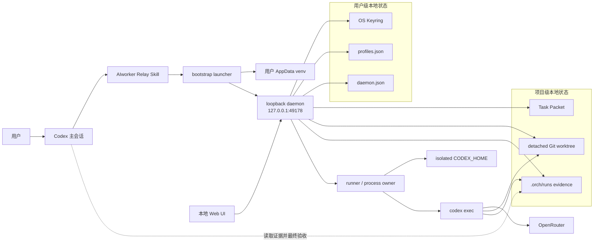

# AIworker Relay 系统审查报告（2026-08-27，GPT-5.6 Pro）

## 审查身份与适用边界

- **Exact reviewed head:** [`641e5c3d51f13d967af1430f29d16cc1d2fa7de6`](https://github.com/liuyejinghong/aiworker-relay/commit/641e5c3d51f13d967af1430f29d16cc1d2fa7de6)
- **审查日期:** 2026-08-27
- **审查对象:** `liuyejinghong/aiworker-relay`
- **审查方式:** 以 GitHub commit/tree/file API 固定读取上述 SHA；所有修复分支均直接从该 SHA 创建。
- **重要限制:** 本报告的结论只适用于上述 exact head。审查期间多次复核时，`main` 仍指向该 SHA；若 `main` 此后移动，新的 head 必须重新审查，不能继承本报告 verdict。
- **GitHub 状态快照:** 审查时 `main` 未启用分支保护或 required status checks；exact head 没有 workflow run 或 commit status。

## 执行结论

产品方向成立：这是一个有价值的、克制的 **Codex 主导、本地控制、单一 OpenRouter 外部执行通道**。它没有把外部 worker 误当成决策者，也没有过早扩展成多供应商路由器、远程编排平台或自动验收系统。这个边界应继续保持。

但是，exact head 不能作为新的外部写入 pre-release 候选，也不能进入 stable release。主要原因不是功能数量不足，而是产品最核心的信任链仍有可达缺口：

1. 外部 worker 的 secret 与 sandbox 边界依赖隐式 Codex 默认，OpenRouter Key 和环境 secrets 可进入 worker 工具环境。
2. loopback Web/API 没有可信身份或 hostile-origin 防护，浏览器跨站请求可触发本地控制操作。
3. daemon 对运行中进程的关闭、重启、失去所有权和退出后证据收敛缺少可靠恢复。
4. `diff.patch`、Profile `verified`、per-run reasoning 与 test evidence 等验收/授权事实并不总是可信。
5. runtime update、source identity、依赖解析和 release gate 不能把“用户实际运行的字节”可靠绑定到 reviewed source。
6. 长时运行遥测、同步 provider 调用和持久化操作可能反过来阻塞观察与停止。

本次审查已创建 20 个按根因拆分的 Issue，以及 3 个未合并的最小修复 PR。修复 PR 处理了明确且局部的根因；需要产品、威胁模型、恢复策略或真实运行证据的问题没有被擅自实现。

## 产品与业务判断

AIworker Relay 的商业价值不在于“再做一个 agent 平台”，而在于降低 Codex 执行负担，同时保持三件事不变：用户明确授权、Codex 保留判断与验收、外部 worker 只提供受限劳动和证据。只要这三点可靠，单一 provider 和单一 harness 反而是早期优势。

当前最大的业务风险是信任事故而不是功能缺失。一次 Key 泄漏、无法停止的计费进程、错误的“已验证/已成功”标签或失败更新破坏 last-known-good runtime，都会比缺少预算图表、多项目切换或第二个 provider 更快损害采用与口碑。因此优先级应是：

- 先固定 secret、sandbox、控制面身份、进程所有权、证据与更新事务；
- 再用真实平台与 provider 验证建立 release gate；
- 最后才扩展 verified promotion、cost/budget、multi-project 和更广 OS 支持。

建议下一阶段继续面向专家开发者，保持单项目、单 provider、显式实验性 Profile、macOS 优先的窄范围；任何范围扩大都应由新的 exact candidate SHA 和可重复证据驱动。

## 审查范围

已覆盖：

- 仓库、marketplace 与 Plugin metadata；
- Skill 入口与用户授权语义；
- bootstrap、安装、更新、恢复与 macOS persistent entry；
- CLI、loopback HTTP/SSE 控制面与 Web UI；
- Keyring、Profile、Task Packet、RunRecord；
- detached Git worktree、外部进程、TERM/KILL；
- isolated `CODEX_HOME`、Codex/OpenRouter provider 配置；
- Result Evidence、diff/file list、成本状态与 RSS 遥测；
- 现有单元测试、requirements、architecture、decisions、verification 记录；
- 审查时当前 Codex sandbox、approval 与 shell environment policy 的官方契约。

未覆盖或未能在本次执行环境中重跑：

- 真实 OpenRouter Key、真实 provider 调用或计费；
- live Codex worker 对 Key、ambient secrets、网络和 worktree 外路径的攻击性 probe；
- Codex Desktop 的安装、刷新、更新与回滚；
- Windows、Linux 与 macOS 的完整 release-candidate matrix；
- daemon crash、PID reuse、磁盘满、权限变化和每个 update checkpoint 的系统级 fault injection；
- Git for Windows、LFS、自定义 clean/smudge/textconv、submodule、split index、非 UTF-8/换行路径等高级 Git 配置；
- 长时间、多 run、慢文件系统的性能与停止延迟；
- 仓库记录的完整 33 项测试。当前执行容器缺少 `keyring` 与 `truststore`，且容器网络不能 clone 仓库；本次只对推送 blob 完成了聚焦测试和语法检查。

没有上传 `.orch/`、本地运行日志、worktree、密钥、用户配置或其他未进入版本控制的本机证据。

## 系统架构与信任边界

关键边界：

- **用户授权边界:** 只有用户明确选择/接受 Profile、同意外部派发并在必要时确认实验性运行，才可发送上下文和产生使用量。
- **本地控制边界:** Web、CLI、daemon、Keyring 和 app-local runtime 都在用户机器上；loopback 不是身份认证本身。
- **项目写入边界:** 外部执行只应修改 detached worktree，不应修改 source/main workspace。
- **外部信任边界:** Codex CLI/OpenRouter/model 均在本地控制面之外；worker 输出不能被当作事实，必须经过本地可验证证据和 Codex 验收。
- **发布边界:** marketplace source、Plugin/runtime version、依赖、daemon identity 和 required checks 必须共同指向同一个可审查 release candidate。

## 已经做对、建议保持的设计

1. **单一外部 harness。** 只有 isolated `codex exec` + OpenRouter 路径，没有隐藏的 provider fallback 或第二套直连实现。
2. **Codex 保留任务判断与最终验收。** Skill 清楚区分 Codex 决策和外部 worker 劳动。
3. **显式 consent、实验性确认和 frozen refusal。** 当前产品拒绝把 frozen Profile 静默替换为别的模型，也不自动重试/路由。
4. **Keyring-only。** Key 不落明文配置文件，也没有不安全 fallback。
5. **detached worktree。** source workspace 的 dirty change 被明确排除并记录，而不是静默复制给外部 worker。
6. **进程组与两阶段停止意图。** TERM 后仅在仍存活时允许确认 KILL，优于直接粗暴终止。
7. **本地、有限的证据集合。** 不持久化完整对话 transcript；失败只保留有限摘要，降低隐私面。
8. **成本不伪造。** 无法可靠归因时使用 `unavailable`，没有把 list price、估算或 `$0` 冒充实际费用。
9. **更新时优先保护 active run。** 发现 active/unknown daemon 时不替换 runtime，方向正确，尽管完整 rollback transaction 仍需补齐。
10. **原生 Codex worker 与外部 relay 分离。** Luna 等 native worker 生命周期没有被错误纳入此控制面。

## Finding 与 GitHub 落地

下表所有对象都针对 exact reviewed head `641e5c3d51f13d967af1430f29d16cc1d2fa7de6`，状态为本报告写入时快照。

| 对象 | 根因与影响 | Release boundary | 当前状态 |
|---|---|---|---|
| [#1](https://github.com/liuyejinghong/aiworker-relay/issues/1) | worker 工具可继承 OpenRouter 与 ambient secrets | 阻塞 broader pre-release / stable | Open；最小修复 [#15](https://github.com/liuyejinghong/aiworker-relay/pull/15)，live probe 待补 |
| [#2](https://github.com/liuyejinghong/aiworker-relay/issues/2) | sandbox 依赖隐式 Codex 默认 | 阻塞 broader pre-release / stable | Open；最小修复 [#15](https://github.com/liuyejinghong/aiworker-relay/pull/15)，真实 containment 待补 |
| [#3](https://github.com/liuyejinghong/aiworker-relay/issues/3) | loopback API 无 hostile-origin/identity gate | 阻塞 broader pre-release / stable | Open；需明确 local-process threat model |
| [#4](https://github.com/liuyejinghong/aiworker-relay/issues/4) | daemon 关闭/重启可失去进程所有权并留下 active 僵尸记录 | 阻塞 broader pre-release / stable | Open；需恢复策略 |
| [#5](https://github.com/liuyejinghong/aiworker-relay/issues/5) | `diff.patch` 漏 staged 与新文件内容 | 阻塞 broader pre-release / stable | Open；最小修复 [#16](https://github.com/liuyejinghong/aiworker-relay/pull/16) |
| [#6](https://github.com/liuyejinghong/aiworker-relay/issues/6) | Profile 可自报 `verified` 绕过实验性确认 | 阻塞 broader pre-release / stable | Open；最小修复 [#17](https://github.com/liuyejinghong/aiworker-relay/pull/17) |
| [#7](https://github.com/liuyejinghong/aiworker-relay/issues/7) | 同步 provider 调用阻塞 event loop、观察和停止 | 阻塞可靠 stable 控制面 | Open；需并发/延迟测试 |
| [#8](https://github.com/liuyejinghong/aiworker-relay/issues/8) | marketplace 跟随未保护 `main`，稳定源可变且无 gate | 阻塞 stable | Open；需 release policy/settings |
| [#9](https://github.com/liuyejinghong/aiworker-relay/issues/9) | Windows/Linux 安装、Keyring、sandbox、stop 证据缺失 | 阻塞跨平台 stable | Open；可先明确 macOS-only pre-release |
| [#10](https://github.com/liuyejinghong/aiworker-relay/issues/10) | worker 没有独立可验证的 test evidence | 阻塞基于存储证据的 stable 验收 | Open；需 evidence ownership 决策 |
| [#11](https://github.com/liuyejinghong/aiworker-relay/issues/11) | `verified` Profile promotion 契约未定义 | 阻塞 verified/recommendation stable 功能 | Open；产品决策 |
| [#12](https://github.com/liuyejinghong/aiworker-relay/issues/12) | per-run cost 无权威 provider correlation | 阻塞 cost/budget stable 功能 | Open；当前 `unavailable` 应保持 |
| [#13](https://github.com/liuyejinghong/aiworker-relay/issues/13) | prompt/diff/worktree/metadata 无 retention/deletion 契约 | 阻塞 wider-user / stable | Open；隐私与生命周期决策 |
| [#14](https://github.com/liuyejinghong/aiworker-relay/issues/14) | multi-project daemon 模型未定义 | 阻塞通用多仓库 stable 声明 | Open；当前跨项目拒绝应保持 |
| [#18](https://github.com/liuyejinghong/aiworker-relay/issues/18) | per-run reasoning override 绕过能力与用户选择校验 | 阻塞 broader pre-release / stable | Open；需先决定是否支持 override |
| [#19](https://github.com/liuyejinghong/aiworker-relay/issues/19) | exact source 不决定依赖/build runtime | 阻塞 reproducible stable | Open；需锁定/哈希/平台策略 |
| [#20](https://github.com/liuyejinghong/aiworker-relay/issues/20) | runtime freshness 只比较 version，不比较 source identity | 阻塞可信 update / stable | Open；需 canonical release fingerprint |
| [#21](https://github.com/liuyejinghong/aiworker-relay/issues/21) | candidate daemon 验收前删除 previous runtime | 阻塞 advertised update pre-release / stable | Open；需 rollback transaction |
| [#22](https://github.com/liuyejinghong/aiworker-relay/issues/22) | RSS history 无界并在 control loop 重写完整状态 | 阻塞长时/并发 stable 可靠性 | Open；需 bounded telemetry/retention |
| [#23](https://github.com/liuyejinghong/aiworker-relay/issues/23) | 退出后证据异常可留下非终态或虚假 `succeeded` | 阻塞 broader pre-release / stable | Open；需 lifecycle/evidence status 契约 |

## 本次创建的最小修复 PR

所有 PR 均从 exact reviewed head 创建，base 为当时仍指向该 SHA 的 `main`；均为 open，未 merge。

| PR | Base SHA | PR head SHA | 修改与真实验证 | 未运行验证 |
|---|---|---|---|---|
| [#15](https://github.com/liuyejinghong/aiworker-relay/pull/15) | `641e5c3d51f13d967af1430f29d16cc1d2fa7de6` | `0a4c10ef0e49e3e0f4edcb172e9e0f1fb7e915ba` | 显式 `workspace-write`；shell env 继承 `core`、启用默认 secret-name 过滤并排除 `OPENROUTER_API_KEY`；1 个聚焦测试与 `py_compile` 通过 | real provider、worker secret probe、网络/路径 denial、完整套件、OS matrix |
| [#16](https://github.com/liuyejinghong/aiworker-relay/pull/16) | `641e5c3d51f13d967af1430f29d16cc1d2fa7de6` | `9efc5459f94cfb7524d4367483c2a4003d2505f6` | 临时 index/object dir 生成完整 binary diff；linked-worktree 聚焦测试覆盖 staged/unstaged/delete/new/empty/binary/ignored 且证明不修改真实 index/status/object DB；`py_compile` 通过 | Git for Windows、LFS/filter/submodule/split-index、大规模 diff、真实 daemon run |
| [#17](https://github.com/liuyejinghong/aiworker-relay/pull/17) | `641e5c3d51f13d967af1430f29d16cc1d2fa7de6` | `6a1ef97ac4748d31fc6ac75a7ce10568f71d7800` | 当前写入入口强制 `unverified`，已存 `verified` 仅加载时保持；1 个聚焦测试与 `py_compile` 通过 | aiohttp 端到端、真实迁移、完整套件；没有实现 promotion |

这些 PR 均未修改 Key、Profile 选择、模型选择或 reasoning effort；没有提交 `.orch/`、本地日志、worktree、密钥或用户配置。

## 仅记录在本报告中的低优先级建议

以下内容未达到独立 Issue 阈值，或已有 owning Issue 能承载后续工作：

- 现有 TERM/KILL 测试用固定 `sleep(0.1)` 等待子进程启动，在慢解释器/CI 上会抖动；改为子进程显式 readiness handshake。
- `changed_files()` 解析 porcelain v1 文本，带引号、换行或复杂 rename 的路径可能显示不准确；diff 内容修复由 #16 覆盖，文件列表边缘兼容可后续加 `-z`。
- 在确认 `codex` 不可用前就创建 worktree/run evidence，会留下没有实际启动的运行目录；可以在不改变授权语义的前提下提前做 executable preflight。
- malformed `profiles.json` 或 `run.json` 当前可能阻止 daemon 启动。原子写降低了正常 tear 风险，但仍建议定义 quarantine、只读诊断和不覆盖损坏证据的恢复方式。
- Task Packet 路径目前可以指向任意本地可读 Markdown。现有 Skill 由 Codex 生成并显式传入，但产品仍应明确是否必须位于 project root、临时目录或受控 packet directory，并限制大小。
- API 对 JSON/body、Profile metadata、catalog snapshot 和 Task Packet 的显式大小上限不清晰；稳定版应给出可解释的本地资源上限。
- SSE subscriber queue 满时事件会被静默丢弃；客户端可重新拉 overview，但缺少 sequence/resync fact。稳定版可增加最小的重同步标识，而不是可靠消息队列。
- 绝对 artifact path 对本地调试有用，但 UI/export 需避免把用户名和目录结构误当作可分享证据。
- 对 symlink、special file、目录替换和清理中断的测试应与 #13 的删除契约一起补，而不是在 diff 收集器里建立通用文件系统框架。
- 当前已有 persisted `verified` Profile 的证据来源不可追溯。#17 有意保持向后兼容；迁移、降级或重新验证应由 #11 的产品决策处理，不能在修复 PR 中静默改写用户状态。

## 尚不能定性的观察

- `docs/verification.md` 记录了 33 项测试和 macOS 实机验收，这些是有价值的历史证据；但 exact head 没有 CI status，本次环境也不能重跑完整套件，因此不能把历史记录等同于当前 required release gate。
- #15 使用的是审查日官方 Codex 配置契约。若产品不声明并验证最低 Codex CLI 版本，未来 CLI 语义变化仍可能改变运行边界。
- 当前 source commit 在 GitHub 状态中显示 unsigned。是否要求签名应由 #8 的 release policy 决定；本报告不把“未签名”单独当作代码缺陷。
- `cost_state = unavailable` 是当前正确行为。它是功能未完成，但不是数据错误；在 #12 的权威归因建立之前不应“优化”为估算 actual。
- 单固定端口/单项目 daemon 的跨项目拒绝是安全的保守行为。产品是否扩展由 #14 决定，不应把拒绝本身修成自动切换。
- local-only 并不等于 trusted-only。#3 需要明确浏览器、同一用户的其他进程、恶意扩展和 DNS rebinding 分别是否在威胁模型内。

## 需要产品负责人回答的问题

1. loopback 控制面只防 hostile browser origin，还是也必须防同一用户下的其他本地进程？是否接受 non-guessable capability token？
2. daemon 崩溃后仍存活的 child 应 reattach、可靠终止，还是标记 ownership lost 并阻止继续计费？如何验证 PID/进程身份？
3. “进程成功但证据不完整”应是什么终态？哪些 artifacts 是 acceptance mandatory？
4. v0.1 是否支持 per-run reasoning override？若支持，哪个 UI/CLI 动作构成用户明确选择，catalog 何时刷新？
5. 一个 Profile 何时可从 `unverified` 晋级为 `verified`？能力、OS、Codex/runtime 版本、reasoning 与时效如何绑定？
6. test evidence 由 worker 报告、daemon 观察，还是 Codex 必须独立重跑？保留多少输出才足够且不扩大隐私面？
7. stable 首批支持哪些 OS/最低版本？Windows/Linux 证据不足时，是否明确收窄为 macOS-only？
8. stable source 使用 tag、签名 commit、content manifest 还是其他 immutable boundary？哪些 checks 必须 required？
9. 依赖如何锁定、哈希和更新？是否接受平台 constraints/lock，而不是同一份跨平台假锁？
10. multi-project 采用 per-user daemon、per-project daemon 还是显式 project switch？active run 时如何处理？
11. actual cost 如何权威关联到 run？预算是提醒、阻止新派发还是 freeze Profile？日/月时区是什么？
12. `.orch` 中 prompt、diff、worktree、CODEX_HOME、events 和 metadata 默认保留多久，谁能删除，uninstall 是否保留？
13. runtime update 的 candidate acceptance 与 rollback transaction 到哪里结束？旧 daemon/runtime 何时才可删除？
14. 稳定支持的最大 run duration、并发数、RSS resolution 和 UI latency 目标是什么？

## 证据缺口

在扩大 pre-release 之前至少需要：

- 在真实 supported Codex CLI 上验证 #15：provider 成功，同时 tool 看不到 OpenRouter Key/ambient secret，不能写出 worktree，命令网络按契约被拒绝。
- hostile-origin、`text/plain`/form/no-cors、Host/DNS rebinding 和 daemon identity 测试。
- graceful shutdown、daemon crash、PID reuse、lost ownership、finalization I/O failure和 restart reconciliation 的 fault-injection matrix。
- #16 通过真实 daemon run 生成可验收的 staged/untracked/empty/binary diff，并在 Git for Windows 上验证。
- #17 的 HTTP 端到端测试，以及 existing `verified` 数据的明确 migration/compatibility 决策。
- blocking provider callback、长时 RSS、慢 fsync、多 SSE client 和 stop latency 的负载测试。
- 每个 claimed OS 上的 clean install、Keyring、sandbox、TERM/KILL equivalent、persistent daemon、update 和 rollback。
- marketplace CLI 与 Codex Desktop 对 immutable candidate 的安装、刷新、更新、失败恢复和回滚。
- 同一 source identity 的可复现依赖解析/构建证据，以及 required CI/status gate。
- actual run test evidence、cost correlation 和 privacy/retention 的 accepted contract。

## 明确不建议的过度设计

在上述信任链闭合前，不建议：

- 增加第二/第三 provider、自动 fallback、自动 retry 或基于 benchmark 的自动路由；
- 建立远程 SaaS 控制面、账户系统、共享数据库、云同步或多租户调度；
- 引入通用 workflow engine、大型状态机框架、事件总线或 Kubernetes 类部署层；
- 自动把 catalog presence、公共 benchmark 或一次成功运行晋级为 `verified`；
- 保留完整 model/tool transcript，或声称对 raw worktree 做了无法证明的全面 secret sanitization；
- 为 RSS 增加 metrics database/远程 telemetry；先做 bounded local summary；
- 在没有平台证据前堆叠兼容层、Windows service/Linux daemon 框架；
- 为了 update 强制停止 active run、静默切项目、静默改 Profile/model/reasoning；
- 创建 tag、Release 或部署来“证明”尚未通过的 stable 状态。

## 建议的收敛顺序

### 1. 新的 source candidate 前

- 评审并验证 #15、#16、#17 的等价修复；
- 对 #3、#4、#18、#21、#23 做最小产品/恢复决策并实现；
- 在 exact candidate 上运行完整测试与 live secret/sandbox/stop/evidence/update probes；
- 将结果绑定到新的 candidate SHA，不把本报告 verdict 自动迁移。

### 2. 限定 pre-release 扩大前

- 解决 #7、#22 的控制面响应性与长时运行边界；
- 明确只支持的 OS、Codex CLI 版本、单项目范围、数据保留披露；
- 建立 hostile-origin 与 crash/finalization fault-injection gate；
- 明确未支持的 cost、verified promotion、Desktop update 行为。

### 3. Stable release 前

- 完成 #8、#9、#10、#11、#12、#13、#14、#19、#20，以及所有仍 open 的前置 blocker；
- 用 immutable source identity、reproducible dependency set、required checks 和 rollback evidence形成一个稳定发布边界；
- 只声明已经在真实平台上验证的支持矩阵。

## 最终 Verdict

- **SOURCE_VERDICT: `CHANGES_REQUIRED`**  
  Exact head `641e5c3d51f13d967af1430f29d16cc1d2fa7de6` 不应被提升或继续分发为新的外部写入 pre-release，也不满足 stable release。尤其在 #1/#2 的修复与 live probe 前，不建议用真实 secrets 执行外部写入任务。

- **PRODUCT_DIRECTION: `CONTINUE_NARROW_CODEX_LED_LOCAL_RELAY`**  
  保持 Codex 主导、本地控制、单 OpenRouter、单 harness、显式 consent、detached worktree、证据后验收的窄产品方向。优先修可信边界，不扩 provider、自动路由或远程平台。

- **RELEASE_BOUNDARY: `NO_BROADER_PRE_RELEASE; NO_STABLE_RELEASE`**  
  下一次有限 pre-release 必须来自一个新的、明确记录的 candidate SHA，在整合等价修复并解决上述 pre-release blockers 后重新审查。Stable release 还必须具备 immutable/reproducible source、required checks、真实 OS/CLI/Desktop matrix、恢复/隐私/证据/成本契约。旧 verdict 不适用于未来 `main`。

## 审查操作声明

本次审查创建了独立 `codex/` 分支、Issue、修复 PR 和本报告文档分支。**没有执行 merge、没有关闭 Issue、没有 force push、没有修改 `main`、没有创建 tag/GitHub Release、没有部署，也没有宣称正式发布。**
