# 新用户使用流程

状态：v0.1.16 已实现固定持久本机看板、supervisor 与派发代码路径，并已完成 Git-backed Marketplace 的干净 CLI 安装/更新和 runtime 版本收敛。LaunchAgent 仅为自身提供解析 Codex CLI/Node 所需的最小 `PATH`，普通用户环境不受改写。相同 NVIDIA 模型已在一次 dashboard-managed detached run 中完成精确 marker 写入、隔离回读和温和停止；修复前的 managed retry 因 `node` 缺失而在 provider 前失败，历史免费模型 `429` 也仍保留为独立失败证据。Profile 的 verified 晋级仍须遵从明确能力标准。



源文件：[aiworker-new-user-flow.mmd](../diagrams/aiworker-new-user-flow.mmd)。

## 首次使用

### 1. 在 Codex 安装 Plugin

用户安装 AIworker Relay Plugin。Codex 识别其中的 `aiworker-relay` Skill；安装本身不改写主 Codex 的模型、provider、原生 worker、系统提示、hooks 或项目 `AGENTS.md`。

公开 pre-release 使用 Git-backed marketplace。正常开发者的安装命令是：

```bash
codex plugin marketplace add liuyejinghong/aiworker-relay --ref main --sparse .agents/plugins
codex plugin add aiworker-relay@aiworker-relay
```

更新 marketplace snapshot 时使用 `codex plugin marketplace upgrade aiworker-relay`。该 CLI 流程已在干净隔离环境实测；已安装 Plugin 在 Codex Desktop 中如何呈现新 bundle，仍应按实际 UI 观察说明。用户不需要先安装独立 Web 产品，也不需要学习一组常用的派发命令。

### 2. 在新 task 中完成 setup

用户新建一个 Codex task，调用 `$aiworker-relay setup`。如果本机运行时尚未存在，这一条明确请求会创建专用 venv、安装 Plugin 的直接运行时依赖，再启动或复用固定地址 `http://127.0.0.1:49178` 的本机 Web 控制面；不再追加一次对话式安装确认。macOS 同时注册用户级 LaunchAgent，因此之后可直接打开该地址，不必再找 Codex 重新打开页面。它不在 Codex 对话、Skill 参数或普通 CLI 中收集 API Key 或模型配置。泛泛的“配置 worker”请求不会自动触发这个 bootstrap。配置只影响外部 worker lane，不影响用户平时的 Codex 工作方式。

### 3. 连接 OpenRouter

用户在本机 Web 控制面的“设置”中录入并测试 OpenRouter API key。完整 key 不回显、不进入仓库、不进入 Task Packet。控制面使用 `keyring` 写入操作系统密钥服务；该服务不可用时拒绝保存，不回退为明文文件。

连接 OpenRouter 与添加 Worker 没有硬性先后关系。本文按“先连接、再添加”说明一条完整路径；用户也可以先粘贴模型名、确认目录信息并保存 Profile。此时页面必须明确显示“Worker 已保存，等待连接”，而不是把它误写成已经可以派发。首次配置的具体优化与验收见 [首次使用体验优化](product-optimization.md)。

需要查看余额时，用户进入“用量”页主动刷新：management Key 可显示账户总额；普通 Key 只有 provider 返回配置限额时才显示“当前 Key 限额”。这不是某次外部 run 的实际费用。

### 4. 添加一个外部 Worker

用户在本机 Web 控制面的 Worker 页面粘贴 OpenRouter 模型标识或模型页链接，例如 `google/gemini-3.7-flash`。控制面查询当前模型目录：

- 唯一匹配时，展示模型名称、上下文窗口、价格、隐私/数据保留提示和实际支持的推理档位；详情页可按用户请求读取与精确模型标识匹配的公开跑分资料。
- 模糊或无匹配时，要求用户选择正确模型或修改输入，不猜测目标模型。
- 用户选择这个 profile 的默认推理策略：固定为模型实际支持的某一档，或显式选择“自动”。
- 用户选择“添加并启用”或“添加为已冻结”。目录发现只创建本地 profile，不触发付费探测，也不代表该模型已经通过本机 harness 验证。

默认推理档位是性价比选择的一部分。比如某个便宜模型只有在高推理时才值得使用，用户就把该 profile 固定为高推理；Codex 不会为了表面节省成本而静默降档。

### 5. 像平时一样向 Codex 提任务

用户仍在 Codex 中说明目标、范围和验收条件。可明确指定一个外部 profile 及推理档位，例如“用 Gemini Flash，高推理完成这个探索任务”。

- 用户明确指定模型或档位时，该选择优先；系统只检查 profile 是否可用，不静默替换或降档。
- 用户未指定时，Codex 可以建议合适 profile，但建议不构成自动授权；用户需要接受建议或明确选择一个 profile。
- 如果 profile 已冻结，派发被拒绝，并明确说明“该模型已冻结”。用户可以先重新启用 profile，或另选一个 worker。

### 6. 观察外部 run

外部 run 启动后，看板展示本地能够确认的事实：状态、开始时间、PID / 进程组、RSS、产物、费用归因状态和停止结果。v0.1 不持久化原始 CLI transcript，因此 token 要等有界来源建立后再展示。原生 Luna worker 只显示为“由 Codex 管理”，不伪造同类遥测。

用户有两种不同操作：

- 冻结 profile：阻止后续派发，保留已经运行的 task。
- 停止当前 run：先发出温和停止；仍存活时，用户可以要求强制终止。看板必须显示实际退出结果。

### 7. 由 Codex 完成验收

worker 返回结果、diff、测试和未解决项后，Codex 根据原始 Task Packet 验收。看板帮助用户看见执行和资源状态，但不取代 Codex 的判断。

## 从历史 alpha 身份迁移

历史 alpha 安装使用的是旧身份。迁移到 AIworker Relay 前，可以用 Codex CLI 移除该旧安装：

```bash
codex plugin remove external-workers@aiworker-local
```

该命令移除 Codex 的旧 Plugin 配置和缓存；不会删除本项目源码、用户应用数据目录中的运行时，或系统钥匙串中的 OpenRouter Key。AIworker Relay 不保留旧 Skill 名称作为长期兼容层；它将从新的 `aiworker-relay` marketplace 安装面提供。

当前 runtime 更新规则见[更新与发布生命周期](update-lifecycle.md)：用户在获得新 Plugin bundle 后显式执行 `$aiworker-relay setup`；空闲 runtime 才会被可恢复地替换，活跃 external run 会让更新明确延后。Profile、钥匙串中的 Key 和项目 `.orch/` 证据不在这次替换中迁移或删除。Git marketplace 的 CLI bundle 更新已实测，仍不能仅根据命令名称推断未观察到的 Desktop UI 行为。

## 第一次真正可接受的闭环

首版运行时应让一位新用户完成下列闭环，而不是堆叠更多功能：

1. 在 Codex 安装 AIworker Relay Plugin，并在新 task 中完成 `$aiworker-relay setup`。
2. 在本机保存并验证 OpenRouter 连接。
3. 从目录创建一个 external profile，并选择真实存在的默认推理档位。
4. 从 Codex 明确派发一个范围受限的任务给该 profile。
5. 在看板看到同一个 run 的真实进程状态与结果证据。
6. 在需要时成功完成一次温和停止，或确认一次强制终止。
7. 由 Codex 根据结果证据给出接受或拒绝结论。

费用显示不是这个闭环的假设前提：只有建立可信的 run-to-cost 归因后，才能把实际费用加入验收。此前必须诚实显示“待归因”或“不可得”。
